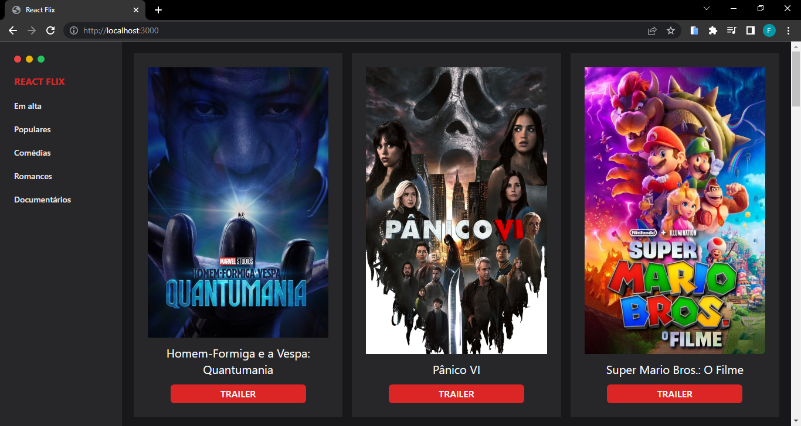
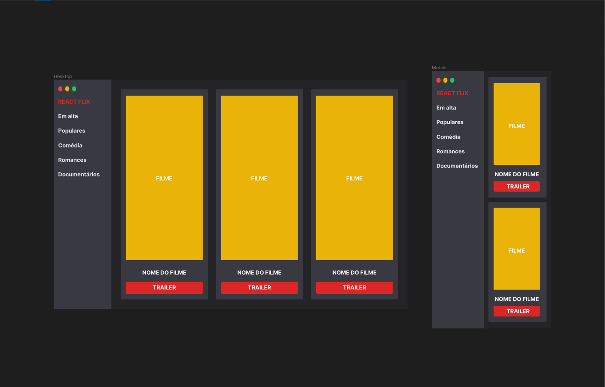

<h1 align="center">Next Flix</h1>

<h3 align="center">A plataforma Next Flix! permite aos usuários navegar e visualizar uma ampla variedade de filmes, divididos por gêneros.</h3>

<div align="center">
  
</div>

<p align="center"><a href="https://next-flix-ten.vercel.app/">Ver Projeto</a></p>

---

<h2>Tecnologias:</h2>

- Next JS
- TypeScript
- Tailwind CSS
- Axios

---

<h2>Prototipagem:</h2>

<div align="center">
  
</div>

<h4 align="center">Feito com <a href="https://www.figma.com/" target="_blank" rel="noreferrer">Figma</a></h4>

---

<h2>Rodando o projeto:</h2>

Você precisa ter o [Node](https://nodejs.org/en/), o [Git](https://git-scm.com/) e algum gerenciador de pacotes([NPM](https://docs.npmjs.com/downloading-and-installing-node-js-and-npm/) | [Yarn](https://classic.yarnpkg.com/lang/en/docs/install)) instalados em sua máquina.

```bash
1. Clone o repositório:
$ git clone https://github.com/felipems1/next-flix

2. Acesse a pasta e instale as dependências via terminal:
$ yarn / npm install

3. Inicie a aplicação em modo de desenvolvimento:
$ yarn dev / npm run dev

4. O servidor será aberto em http://localhost:3000
```

<p align="center">Projeto feito com ❤️ por <a href="https://www.linkedin.com/in/felipems1/">Felipe Moises</a></p>
